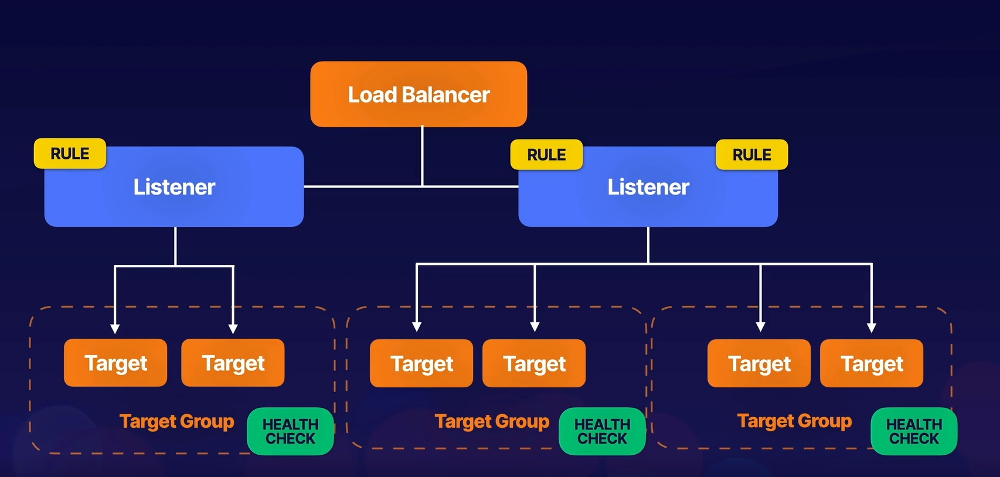

# Elastic Load Balancing

1. Distributes incoming multiple traffic to multiple targets ( Ex: EC2 )
1. Types :
    - Application Load Balancer - `Intelligent` , `Layer 7`
    - Network Load Balancer - `Performance` , `Layer 4` , `best suited for TCP traffic`
    - Gateway Load Balancer 
    - Classic Load Balancer - `Test / Dev env`

1. Load Balancer performs health check on all instances.
1. Load Balancer routes requests only to healthy instances.

## Application Load Balancer

1. Function at Application Layer - 7th Layer of OSI ( Open System Interconnection ) model.
1. Path Based LB ( For Example - url of fetching an image can be done using another EC2 machine )

### Listeners

1. Checks for connection requests from clients, using the protocol & port we configure.
1. We define `Rules`
1. To use a HTTPS listener , we must deploy at least one SSL/TLS server certificate on our LB.

### Targer Groups

1. Each target group routes requsts to one or more registered targets, such as EC2 instances.

### Limitations

1. `Only HTTP & HTTPS`

## Network Load Balancer

1. Layer 4 Load Balancing
1. After LB receives a connection request , it selects a target from the target group for the default rule. It also attempts to open a TCP connection to the selected target
1. `There are no listener rules`.
1. Protocols supported - TCP,TLS,UDP,TCP_UDP
1. Ports - 1-65535

## Classic Load Balancer

1. Legacy
1. `X-Forwarded-For` - When traffic is sent from LB, the server access logs contains the IP address of the proxy or LB only. `Need IPv4 of the end use`.
1. `504` Error - Gateway timeouts meaans apps/db  is having issues not the LB. 

### Sticky Session

1. Bind a user's session to a specific EC2 instance.
1. We can use it with Application Load Balancer as well , but it will go to target group level.

## Deregistration Delay

1. Allows LB's to keep existing connections open if EC2 instaces are de-registered or become unhealthy.