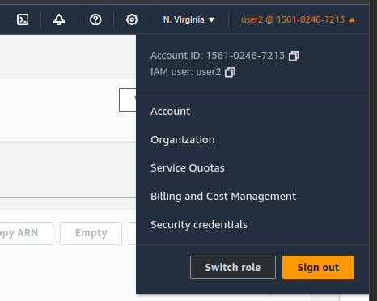
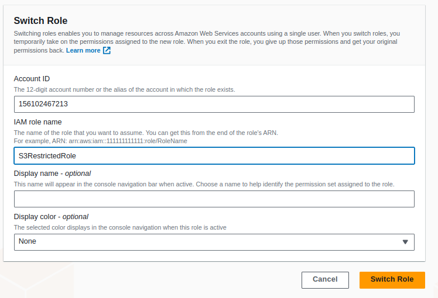
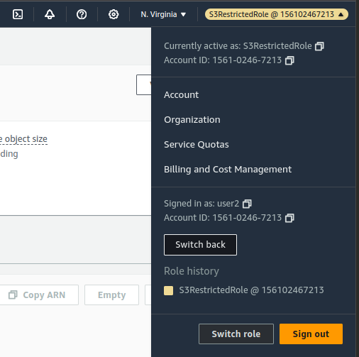

# IAM

1. Manage users and their level of access to the AWS Console
1. Create users and grant permission to those users
1. Greate Groups and roles
1. Control access to AWS Resources

### Root Account 

1. Email address you used to sign up for AWS
1. Full Admin access

### Steps to Secure Root Account 

1. MFA
1. Create a admin group wtih appropriate permission
1. Create user account for your admins
1. Add your users to the admin group.

### Control Permission using IAM

1. Policy Documents [ JSON ]

    ```json
    {
        "Version": "2012-10-17",
        "Statement": [
            {
                "Effect": "Allow",
                "Action" : "*", --> allow every actions
                "Resource": "*"  --> allow every resource
            }
        ]
    }
    ```

1. `IAM Policy Documents` can be assigned to groups,users & roles.

### IAM Building Blocks

1. Users -> Physical Person
1. Group -> Admins,devs,etc
1. Roles -> Internal Usages within AWS 
    - One part of AWS to access another part of AWS
    - Allow EC2 Machine to access S3 Buckets

1. IAM policies can be directly assign to users but difficult to manage.
1. Best Practice is to assign policies to Group
1. `Principle of Least Privilage`
1. AWS has already created some usefull policies for us such as 
    - PowerUserAccess -> Provides full access to AWS services and resources, but does not allow management of Users and groups.
    - ViewOnlyAccess -> This policy grants permissions to view resources and basic metadata across all AWS services.

1. IAM is Univrsal -> region lock doesn't apply
1. When a new user is created , the user is devoid of policy permission. Only password changes are allowed.
1. Indentity providers ( IAM Federation )
    - Allows us to connect IAM to Active Directory
    - Supports SAML,OpenID connect
    - Enables SSO

#### Progamatic Access ( CLI )

1. Create a Access Key
1. We get a access key ( username ) &  seret access key ( password )
1. If you lose them, you have to regenerate them. Save em


#### Managed Policy

1. Created by AWS or Account Admin Ex: PowerUserAccess

#### Inline Policy

1. Custom created policy
1. Policy attached to one user or group
1. Typicall used for 1 off situation
1. `Explicit Deny`
    - Always override any allow.
    - If there is a deny on a policy that applies to a user , that deny will override all allows

#### IAM Role

1. A role is an indentity you can create in IAM that has specific permissions. A role is similar to a user , as it is an AWS identity with permission policies that determine what the identity can and cannot do in aws . However being uniquely associated with one person , a role is intended to be assumable by anyone who needs it
1. Made up of 2 components
1. Permission ( What you can do ) & Trust Policy ( Who can assume it )
1. Switching role could be a bit tricky to grasp. 
1. Only when a user assumes a role , the permissions are activated
1. Roles can allow cross-account access. This allows one aws account the ability to interact with resources in other AWS accounts.
1. IAM Role can be created without any policies attached to it
1. Trusted entities JSON below ( This doesn't showcase the policies attached to a role )

    ```json
    {
        "Version": "2012-10-17",
        "Statement": [
            {
                "Effect": "Allow",
                "Action": "sts:AssumeRole",
                "Principal": {
                    "AWS": "156102467213"
                },
                "Condition": {}
            }
        ]
    }
    ```

1. Assinging role top a USER ( Which USER can assume the role )
1. Trusted entities JSON below ( This doesn't showcase the policies attached to a role )

    ```json
    {
        "Version": "2012-10-17",
        "Statement": [
            {
                "Effect": "Allow",
                "Principal": {
                    "AWS": "arn:aws:iam::156102467213:user/user2"
                },
                "Action": "sts:AssumeRole",
                "Condition": {}
            }
        ]
    }
    ```

1. Now USER 2 can assume the role
1. `arn:aws:iam::156102467213:user/user2` -> ARN of User 2
1. IAM USER

    


1. Switch Role

    

1. Role User

    

