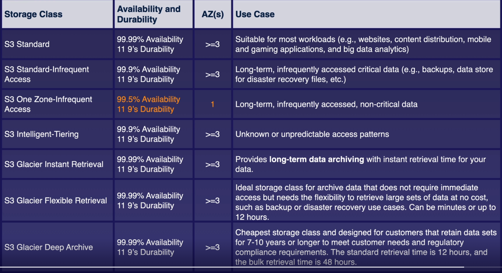

# S3

1. Oldest services of AWS
1. Manages data as objects rather than in file system or data blocks
1. S3 Objects can have a max size of 5 
1. Universal namepsace - Each S3 bucket name is globally unique
1. Example URL - https://bucket-name.s3-region.amazonaws.com
1. When you upload a file to an S3 Bucket , you will receive an `HTTP 200` code if the upload was successfull.
1. Its a key-value store. Key here is the name & value is the data itself.
1. Built for availability , designed for Durability
1. Buckets are private by Default -> You have to allow public access on both the bucket and its objects in order to make the bucket public
1. S3 scales automatically with demand.


## Security

1. Server Side Encryption -> Encrypt all new objects when they are stored in a bucket
1. `ACL's` -> Define which AWS Accounts or groups are granted access and the type of access. You can `attach S3 ACL's to individual objects` within a bucket. Make individual file public etc..
1. Bucket Policies ->  Specify  what actions are allowed or denied for a bucket. ( PUT , DELETE etc..)
    - Bucket wide , applies to all objects in a bucket.


### Strong read-after-write consistency

1. After a successfull write of a new object or an overwrite of an existing object , any subsequent read request immediately receives the latest version of the object
1. `Strong Consistency` - For list operations ( list all the objects in a bucket ) , so after a write , you can immediately perform a list of the objects in a bucket with all the changes reflected.


### Make S3 Bucket Objects Public ( Not ideal )

1. Bucket -> Permission -> Block public access (bucket settings) -> Edit -> Unheck 'Block all public access' -> Save Changes
1. Bucket -> Permission -> Object Ownership -> Edit -> Edit Object Ownership -> ACLs enabled -> Check I acknowledge that ACLs will be restored -> Save Changes
1. Bucket -> Select 1 Object -> Actions Drop Down -> Make public using ACL -> Click 'Make public'
1. Bucket -> Click on the object which was made public -> CLick on 'Object URL'

### Static Websites S3 

1. Host Static content
1. Bucket -> P roperties -> Static website hosting -> Proviode the html pages
1. Bucket -> Permissions -> Bucket policy -> 

```json
{
	"Version": "2012-10-17",
	"Statement": [
		{
			"Sid": "PublicReadGetObject",
			"Effect": "Allow",
			"Principal": "*",  
			"Action": [
				"s3:GetObject"
			],
			"Resource": [
				"arn:aws:s3:::acloudguruwebsite9013/*"
			]
		}
	]
}  
```


1. The above policy will make the bucket public


## Versioning Objects in S3

1. We can enable it in S3 , multiple version of an object in S3.
1. All version are stored in S3
1. Great for Backup. Once enabled cannot be disbaled only suspended.
1. Lifecycle rules 
1. Can support MFA

### Delete

1. We generally don't delete an object. We just put a delete marker on the object.

## S3 Storage Class

### S3 Standard 

1. High Durability -> Data stored redundantly across multiple AZ's
1. Designed for frequent access
    - Suitable for most workloads
    - Good for Content Distribution, Big Data Analytics
1. Ex
	- Media company which wants to host VIDEO / PICTURES , static objects

### S3 Standard - IA ( Infrequent Access )

1. Rapid Access -> Used for data that is accessed less frequently but requires rapid access when needed.
	- We pay to to access the data
	- low per GB storage price
	- per GB retrieval fee
1. Use Cases 
	- Great for long term storage
	- Backups and as a datra store for disaster recovery files

### S3 Standard - One Zone IA ( Infrequent Access )

1. Single Zone
1. Costs 20% less than standard IA
1. Great for long-lived, infrequent accessed , non critical data

### S3 Standard - Intelligent Tiering

1. Automatically moves our data to the most cost effective tier


### S3 - Glacier - 3 Options

1. Pay each time we access the data
1. Only for archiving data
1. Glacier is cheap storage
1. Optimized for data that is very infrequently accessed

#### Option 1 - Glacier Instant Retrieval

1. Provides long term data archiving with instant retrieval time for you data

#### Option 1 - Glacier Flexible Retrieval

1. S3 Glacier Flexible Retrieval delivers low-cost storage, up to 10% lower cost (than S3 Glacier Instant Retrieval), for archive data that is accessed 1—2 times per year and is retrieved asynchronously
1. S3 Glacier Flexible Retrieval delivers the most flexible retrieval options that balance cost with access times ranging from minutes to hours and with free bulk retrievals.
1. It is an ideal solution for backup, disaster recovery, offsite data storage needs, and for when some data occasionally need to be retrieved in minutes, and you don’t want to worry about costs

### Option 2 - Glacier Deep Archive

1. S3 Glacier Deep Archive is Amazon S3’s lowest-cost storage class and supports long-term retention and digital preservation for data that may be accessed once or twice in a year.
1. It is designed for customers—particularly those in highly-regulated industries, such as financial services, healthcare, and public sectors—that retain data sets for 7—10 years or longer to meet regulatory compliance requirements.

### Refresher



## Lifecycle Management 

1. Lifecycle management automates moving you objects between the different storage tiers  , thereby maximizing cost effectiveness
1. Can be used in Conjuction with Versioning

## S3 Object Lock

1. Used to store objects using a write once, read many ( `WORM` ) model.
1. It prevents objects from being deleted or modified for a fixed or indefinite amount of time
1. We can use S3 Object lock to meet regulatory requirements
1. `GOVERNANCE MODE` - Users can't overwrite or delete an object version or alter its lock settings unless they have special permissions. `Parital Lock`
1. `COMPLIANCE MODE` - A `protected object version can't be overwritten or deleted by any user, including the root user` in your aws account.When an object is locked in compliance mode, its retention mode can't be changed and its retension period can't be shortened. `Full Lock`
1. `Can be done on individual objects or applied across the bucket as a whole`

### Retention Period

1. Protects an object version for a fixed amount of time.
1. Timestamp in object version's metadata to indicate when the retention period expires
1. After it expires , the object version can be overwritten or deleted unless you also placed a `legal hold` on the object version.

### Legal Hold

1. Prevents an object version from being overwritten or deleted.
1. Legal hold can be freely placed and removed by an user who has`s3:PutObjectLegalHold` permission


### Galcier Vault Lock

1. Similar thing but for S3 Glacier  

## Encryption 

### Types of Encryption

1. Encryption in Transit
	- SSL/TLS 
	- HTTPS 
1. Encryption at REST -> Server side Encryption -> `Enabled by Default`
	- `SSE-S3` -> S3-managed Keys, using AES 256bit Encryption -> `Enabled by Default`
	- `SSE-KMS` -> AWS Key Management Service managed Keys
	- `SSE-C` -> Customer Provided Keys
1. Encryption at Rest -> Client Side Encryption
	- We Encrypt the files ourself before uploading to S3
1. Enforcing encryption with a Bucket policy 
	- Bucket policy can deny all PUT requests taht don't include the `x-amz-server-side-encryption` parameter in the request header


#### Enforce Server Side Encryption 

1. If the file is to be encrypted at upload time the `x-amz-server-side-encryption` parameter will be included in the request header
1. Two Options
	- `x-amz-server-side-encryption : AES256` -> SSE-S3
	- `x-amz-server-side-encryption : aws:kms` -> SSE-KMS
1. PUT request Header
1. We should also create a bucket policy that denies any S3 PUT Request that doesn't include the `x-amz-server-side-encryption` parameter in the request header.


## Optimizing S3 Performance

#### S3 Prefixes

1. Folders inside our S3 Bucket ->  `mybucketname/folder/1.jpg`  -> prefix:`folder1`
1. Folders inside our S3 Bucket ->  `mybucketname/folder/dataset/1.jpg`  -> prefix:`folder/dataset`

#### S3 Performance 

1. 3,500 PUT/COPY/POST/DELETE per second
1. 5,500 GET/HEAD requests per second
1. We can get better performance by spreading your reads across different prefixes.
	- 2 prefixes we can achieve 11,000 requests per second

### S3 Limitations when using KMS

1. If you are using SSE-KMS to encrypt your objects in s3, you must keep in mind the KMS limits
1. When you `upload` a file, you will call  GenerateDateKey in the KMS API.
1. When you `download` a file , you will call Decrypt in the KMS  API.
1. KMS Request Rates -> Region specific -> 5500 , 10300 , 30000 requests per seconds
1. Currently we cannot request a quota increase for KMS
1. Uploading / downloading will count towards the KMS quota

### Multipart Uploads

1. Recommended for files over 100 MB
1. Required for files over 5 GB
1. Parallelize upoloads ( Increased Efficiency)

### S3 Byte - Range Fetches

1. Parallelize downloads by specifying byte ranges
1. If there is a faiulure in the download , its only for a specific byte range.

## S3 Replication

1. Replicate objects from one bucket to another.
	- Versioning must be enabled on both buckets and destination buckets
1. Objects in an existing bucket are not replicated automatically.
	- Once replication is turned on, all subsequents upladted objects will be replicated automatically.
1. Delete markers are not replicated by default.


