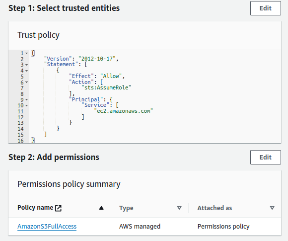

# AWS Command Line

1. Create a EC2 Instance with Generate key-pair pem file
1. Connect to EC2 Instance with `EC2 Instance Connect`
1. Lets fire some commands, thanks to AWS CLI Installed by default in our  EC2 Instance

    ```ps
    [ec2-user@ip-172-31-28-216 ~]$ ^C
    [ec2-user@ip-172-31-28-216 ~]$ sudo su
    [root@ip-172-31-28-216 ec2-user]# dnf update -y

    ```

1. Lets list the S3 Buckets in our account

    ```ps
    [root@ip-172-31-28-216 ec2-user]# aws s3 ls
    Unable to locate credentials. You can configure credentials by running "aws configure".
    ```

1. Lets configure.
1. Navigate to IAM -> Create user group with admin access is S3 say called `admin-s3`
1. The Permission policy with look something like below


    ```json
    {
        "Version": "2012-10-17",
        "Statement": [
            {
                "Effect": "Allow",
                "Action": [
                    "s3:*",
                    "s3-object-lambda:*"
                ],
                "Resource": "*"
            }
        ]
    }
    ```

1. Lets go back to IAM & create a USER, make sure to not check `Provide user access to the AWS Management Console` as we are creating `programmatic access` user
1. Add user to our `admin-s3` group.
1. Now navigate to `security_credentials` for our user & scroll to `Access keys`.
1. Back to the EC2 Instance Connect ClI & paste details

    ```ps
    [root@ip-172-31-28-216 ec2-user]# aws configure
    AWS Access Key ID [None]: *****
    AWS Secret Access Key [None]: ****
    Default region name [None]: 
    Default output format [None]: 
    [root@ip-172-31-28-216 ec2-user]# 
    ```
1. Now we have configured our CLI, we can run commands

    ```ps
    [root@ip-172-31-28-216 ec2-user]# aws s3 ls
    2024-05-16 12:23:57 randomcodetestbukcer
    [root@ip-172-31-28-216 ec2-user]# aws s3 mb s3://31982jd89s2189ej219jds8129
    make_bucket: 31982jd89s2189ej219jds8129
    [root@ip-172-31-28-216 ec2-user]# aws s3 ls
    2024-05-16 12:25:28 31982jd89s2189ej219jds8129
    2024-05-16 12:23:57 randomcodetestbukcer
    [root@ip-172-31-28-216 ec2-user]# 
    ```


## IAM Role Excercise

1. Create an IAM Role with S3 Access
1. Create an EC2 Instance & Attach the role
1. Create S3 Bucket using command line
1. Access S3 from our EC2 Instance

### Lets get Started
1. Create a role which gives admin access to S3 for EC2 -> Trusted entity type -> AWS service
1. Use case -> EC2 ( Allows EC2 instances to call AWS services on your behalf )
1. Permissions policies -> AmazonS3FullAccess
1. Role name -> `S3Role` -> Create role

    

1. Go back to EC2 -> Create a new instance with name `MyAmazonServer`. 
1. Once the EC2 app starts -> Actions -> Security -> Modify IAM role -> Attach the S3 Role
1. Connect to EC2 using `EC2 Instance Connect`
1. Lets fire the commands

    ```ps
    [ec2-user@ip-172-31-20-178 ~]$ sudo su
    [root@ip-172-31-20-178 ec2-user]# aws s3 ls
    2024-05-16 12:25:28 31982jd89s2189ej219jds8129
    2024-05-16 12:23:57 randomcodetestbukcer
    [root@ip-172-31-20-178 ec2-user]# aws s3 mb s3://3821j9821je812j8
    make_bucket: 3821j9821je812j8
    [root@ip-172-31-20-178 ec2-user]# aws s3 ls
    2024-05-16 12:25:28 31982jd89s2189ej219jds8129
    2024-05-16 14:13:36 3821j9821je812j8
    2024-05-16 12:23:57 randomcodetestbukcer
    [root@ip-172-31-20-178 ec2-user]# 
    ```

1. Because we have role attached we can directly access S3. If not we would have seen `Unable to locate credentials. You can configure credentials by running "aws configure".`
1. So why use role instead of credential showcased in 5.Commandline.md file ? Because if this machine got hacked the user can fetch id & secret.