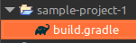

# Gradle

1. Build Tool & Dependency Manager
2. DSL - Domain Specific Langauge - Groovy 
3. Eclipse Buildship Plugin is used in this tutorial

## Lets get started 

1. Create a simple project ( NOT JAVA ) in Eclipse
2. Create a file - `simple-project-1/build.gradle`
```groovy
task('hello').doLast{
	println "Hello World"
}
```

3. Lets try to run it using gradle buildship.
4. Eclipse -> Window -> Show View -> Other -> Search and select 'Gradle Tasks'
5. Now we need to add the gradle nature to the project.
Right Click on the project -> Configure -> Add Gradle Nature. We notice gradle icon appearing on the project.

    
    

6. Cool. Now lets Right Click on the project -> Run as -> Run Configuration -> Create a new config for gradle task -> Use the below image to create a config

    

7.  Hit Apply and Run. In the console we see 

    ```bash
    Working Directory: /home/syndicate/Documents/CodeSource/eclipse-workspace/sample-project-1
    Gradle user home: /home/syndicate/.gradle
    Gradle Distribution: Gradle wrapper from target build
    Gradle Version: 8.1.1
    Java Home: /usr/lib/jvm/jdk-17.0.2
    JVM Arguments: None
    Program Arguments: None
    Build Scans Enabled: false
    Offline Mode Enabled: false
    Gradle Tasks: hello


    > Task :hello
    Hello World

    BUILD SUCCESSFUL in 115ms
    1 actionable task: 1 executed
    ```

8. Note : If the project doesn't appear on the 'Gradle Tasks' , we can delete it from eclipse ( not the source ) and import it as a gradle project.
    
     

9. Cool , now lets run it from the 'Gradle Task'. Right click and we see 'run default gradle task'. Lets run it.

    ```bash
    Working Directory: /home/syndicate/Documents/CodeSource/.
    .
    .

    > Task :help

    Welcome to Gradle 8.1.1.
    .
    .
    BUILD SUCCESSFUL in 28ms
    1 actionable task: 1 executed

    ```
10. Interesting we see a entirely different thing. We don't see our hello task fired.
11. Its because gradle needs to know the default tasks it need to run. We can do this instead 

```groovy
defaultTasks 'hello'
task('hello').doLast{
	println "Hello World"
}
```
12. If we run the default tasks from Gradle task. We see hello back on. :smiley: 

14.

## Groovy - Java Connection

1. File - sample-project-1/build.gradle

```groovy
import java.text.*

println "Hello World"
System.out.println "Hello World Java"

SimpleDateFormat sdf = new SimpleDateFormat("yyyy-MM-dd'T'HH:mm:ss'Z'")
sdf.setTimeZone(TimeZone.getTimeZone("UTC"))
System.out.println "Hello World DateTime : " + sdf.format(new Date())

System.out.println "Date : " + new Date()
System.out.println "Date : " + LocalDate.now()

sayHelloSyndicate() // Method called before creation
void sayHelloSyndicate(){
	println "Hello Syndicate"
}

int doubleIt(int i){
	println "Method doubleIt Input : " + i
	i * 3;
}
print "Method doubleIt Invoked : " + doubleIt(2)
```
2. Lets run it using default gradle configuration or using the gradle task. We see in Output
```
....
> Configure project :
Hello World
Hello World Java
Hello World DateTime : 2024-01-12T07:43:42Z
Date : Fri Jan 12 13:13:42 IST 2024
Date : 2024-01-12
Hello Syndicate
Method doubleIt Input : 2
Method doubleIt Invoked : 6
```

3. So we can comment that we can write java syntax in groovy in most cases.
4. Gradle analyses the whole build script before executing it. So we can call the function before it was coded.
5. In groovy the return statement is optional, if there is more than one line in a method the last time auto-returns

6. Taking the groovy scripting a little forward with the below example.  Notice the returned value.

    ```groovy
    int doubleIt(int i){
        println "Method doubleIt Input : " + i
        i * 3;
        def y = i; // value of 'y' is auto-returned here
    }
    print "Method doubleIt Invoked : " + doubleIt(2)
    ```

    Ouput:
    ```
    > Configure project :
    Method doubleIt Input : 2
    Method doubleIt Invoked : 2
    ```
## Types in Groovy

https://groovy-lang.org/objectorientation.html

1. Keyword `def` is used to indentify untyped variable.
2. `def` is like Object is Java :coffee:.
3. `def` doesn't provide type-safety.
    ```groovy
    def number1 = "25"
    int number2 = 30

    println number1
    println number2
    ```

    Output:
    ```
    > Configure project :
    25
    30
    ```
4. So the above code passes. If we try something like
`int number3 = "35"` we get `Cannot cast object '35' with class 'java.lang.String' to class 'int'` Runtime execption.

5. Because Groovy is dynamic languge type checking is performed at Runtime not compile time.

6. String can be wrapped in either double or single quotes. We can also used multi-line strings used in Java 17 :coffee:.

7. It also supports String Interpolation. It only works with double quotes.
```groovy
int x = 4
println "x:$x" // x:4
println 'x:$x' // x:$x
```

## Properties ( Similar to Getter & Setters )

1. Its present my default.
2. Although the code looks like we got direct access , its not though. Thats what makes it properties.

    ```groovy
    class Person{
        String name
        Integer age
        
        Person(name,age){
            this.name = name
            this.age = age
        }
    }

    Person p1 = new Person("Fred",35)
    println p1.name // Fred
    p1.name = "John"
    println p1.name // John

    Map m = new HashMap()
    m.put("A","Aragon")
    println m.get("A") // Aragon

    // However using the property syntax , the actual key becomes the property

    m.A = "Aristrocract"
    m.B = "Baldur"
    m.C = "Caranthian"

    println m.A // Aristrocract
    println m.B // Baldur
    println m.C // Caranthian
    ```
