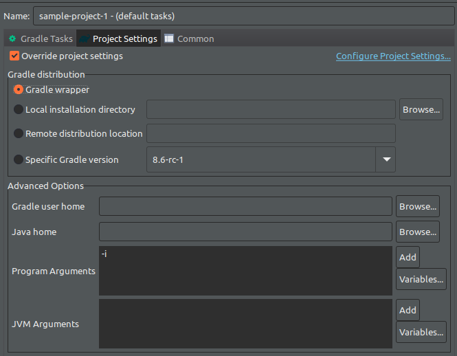

# Gradle Object Model or Gradle API

### 6 key interfaces

1. Script < Interfaces >  - Implemented by all gradle scripts
2. Project < Interfaces > - Associated with build.gradle file
3. Gradle < Interface >
4. Settings < Interface > - More aligned with Multi-Project
5. Task < Interface >
6. ?

## Sneak Peek into Script < Interfaces >

1. Implemented by all gradle scripts ( File ending in .gradle )
2. https://docs.gradle.org/current/dsl/org.gradle.api.Script.html#org.gradle.api.Script

3. Lets use the loggin feature offered by SCRIPT API.
4. But first we need to provide an argument for the run configuration

    

5. Once we run it we get a lot of logs... !

    ```groovy
    logger.info "Hello There!"
    ```
    Output:

    ```
    > Configure project :
    ..
    Hello There!
    ..
    ```
6. Now among the sea of logs, we can finally find our `Hello There!`


## Gradle LifeCycle

1. Initialization Phase
    - During this phase that gradle deteremines which project ( Multi-project ) will take part in the build & creates a project instance of each of the projects.
   - Can maps to one or more file ex : `init.gradle`, `xxx.gradle`,`settings.gradle`
   - Setup initial properties etc etc
2. Configuration Phase 
    - `build.gradle` 
    - the delegate object is the project
3. Execution Phase
    - Actual build is performed. 
    - Tasks & Actions gets perfromed
    - `build.gradle`  


4. Lets look at a example. Say we have 2 files
    
    `sample-project-1/build.gradle`

    ```groovy
    println "From build.gradle"
    println "favNumber : ${gradle.favNumber()}"
    ```
    & `sample-project-1/settings.gradle`

    ```groovy
    println "From settings.gradle"
    gradle.ext.favNumber ={
        return 2
    }
    ```
 
5. Once we run the project we observe : 

    ```
    From settings.gradle
    > Configure project :
    From build.gradle
    favNumber : 2
    > Task :help
    ```
6. Content in settings.gradle is executed before build.gradle as expecteed.

7. For `build.gradle` the `Script <interface>` delegates to `Project <interface>` during the configuration phase. It also depends on the lifecycle.

8. For `settings.gradle` the `Script <interface>` delegates to `Setting <interface>` during the initialization phase. It also depends on the lifecycle.

9. For `init.gradle` the `Script <interface>` delegates to `Gradle <interface>` during the initialization phase. It also depends on the lifecycle. 