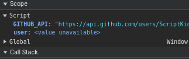
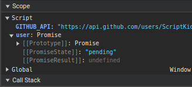
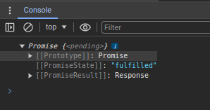
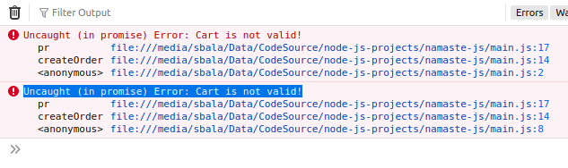
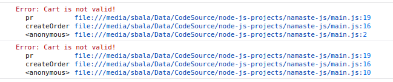
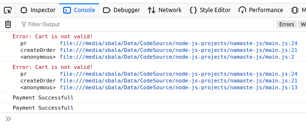

# Promises

1. Lets have shopping cart example with 2 async calls

    ```js
    //hypothetical code
    const cart = ["Shoes", "Pants", "Kurta"];
    createOrder(cart) // returns orderID
    proceedToPayment(orderId)
    ```

2. First we execute the logic using callbacks

## CallBacks

```js
// hypothetical code
const cart = ["Shoes", "Pants", "Kurta"];
createOrder(cart, function () {
  proceedToPayment(orderId);
});
```
1. The issue here is IOC mentioned in the previous document.

## Promise

1. The Promise object represents the eventual completion (or failure) of an asynchronous operation and its resulting value. 
2. It will hold whatever the function will return to us. For createOrder
```js
const promiseOrder = createOrder(cart);
```
3. It will return us a an object when its done processing.
4. At the very start after invocation the `promiseOrder` variable will be set a `undefined` , but once the `createOrder(cart)` is executed it will populate the `promiseOrder` variable.
5. Now once the `promiseOrder` variable is populate we can attach a callback function to it. Thus ensuring order.
```js
// hypothetical code
const promiseOrder = createOrder(cart);
promiseOrder.then(function () {
  proceedToPayment(orderId);
});
```
6. Once we get the `promiseOrder` we run `proceedToPayment()`
7. Difference between callback-hell and promise ?
8. Passing  `proceedToPayment()` to the callback function and attaching `proceedToPayment()` to a promise. We get control of our API call back to us. Javascrpt Garuntees us the then call will work.

### Example
1. Browsers offers us a Fetch Function that makes calling API's easier.
2. fetch() returns us a promise.
```js
const GITHUB_API_URI = "https://api.github.com/users/ScriptKiddie47";
const user = fetch(GITHUB_API_URI);
console.log(user)
```
3. We will put a debugger in the browser for line 2.Before invocation

4. Once we go forward with the debugger we see

5. Right now the promise is in a pending state.`PromiseResult` will store the data. `PromiseState` tells you about the promise state.
6. In the console we see something unique

7. On Top we see pending but once we expand we see `PromiseState` as fulfilled. This is because of chrome way of handling things.
8. So how do we get the response. We can use a then function

```js
const GITHUB_API_URI = "https://api.github.com/users/ScriptKiddie47";
const user = fetch(GITHUB_API_URI);
user.then(function (data) {
  console.log(data);
});
// Output
//Response {type: 'cors', url: 'https://api.github.com/users/ScriptKiddie47', redirected: false, status: 200, ok: true....
```
9. Promise objects are immutable so no one can edit

## <strike>Promise Chaining</strike>  Promise Hell 

1. We need to make a call to 4 api's in an order and all of them return promises.

```js
const cart = ["Shoes", "Pants", "Kurta"];
createOrder(cart);
proceedToPayment(orderId);
showOrderSummary(paymentInfo);
updatewalletBalance();
```

2. So we can do something like promise chaining

```js
const cart = ["Shoes", "Pants", "Kurta"];
createOrder(cart).then(function () {
  return proceedToPayment(orderId).then(function () {
    return showOrderSummary(paymentInfo).then(function () {
      return updatewalletBalance(paymentInfo);
    });
  });
});
```
3. notice the usage of `return`. This is mandatory as we are returning a promise when we are chaining it. We can use arrow function

```js
const cart = ["Shoes", "Pants", "Kurta"];
createOrder(cart)
    .then((orderId) => proceedToPayment(orderId)
    .then((paymentInfo) => showOrderSummary(paymentInfo)
    .then((paymentInfo) => updatewalletBalance(paymentInfo))));
```
## Create our own Promise

1. We use the Promise Contructor - Below is a success scenario

```js
const cart = ["shoes","pants","kurta"];
const promise = createOrder(cart); // returns orderId
promise.then(function(orderId){
    console.log(orderId);
})

createOrder(cart)
    .then((orderId)=>{console.log(orderId)})

// Lets create our own promise
function createOrder(cart){
    // Promise constructor is invoked
    const pr = new Promise(function(resolve,reject){
        // Logic to CreteOrder - Validate cart, DB calls , etc..
        if(!validateCart(cart)){
            const err = new Error("Cart is not valid!");
            reject(err)
        }
        const orderId = "2312312";
        if(orderId){
            setTimeout(function(){
                resolve(orderId);
            },5000);
        }
    })
    return pr;
}

function validateCart(cart){
    return true;
}

```

1. Output we get is `2312312` twice. As we triggered the function twice in different JS formats
1. If we return `false` for validateCart. We now reject our promise. And in the browser we observe in Red color



1. Which means we haven't handled the promise.
1. So what we can do is attach a catch which is nothing but a failure callback

```js
const promise = createOrder(cart); // returns orderId
promise.then(function (orderId) {
    console.log(orderId)
    // proceedToPayment(orderId); // returns
}).catch(function (err) {
    console.log(err)
})
createOrder(cart)
    .then((orderId)=>{console.log(orderId)}).catch((err)=>{console.log(err)})
```




1. We good ! 

## Promise Chaining 

1. Keep an eye on the `return` statement
1. Lets look at a happy path scenario

```js
const cart = ["shoes", "pants", "kurta"];
const promise = createOrder(cart); // returns orderId
promise.then(function (orderId) {
    console.log(orderId)
}).then(function (orderId) {
    return proceedToPayment(orderId);
}).then(function (paymentInfo) {
    console.log(paymentInfo)
}).catch(function (err) {
    console.log(err)
})

createOrder(cart)
    .then((orderId) => { console.log(orderId) })
    .then((orderId) => proceedToPayment(orderId))
    .then((paymentInfo) => { console.log(paymentInfo) }).catch((err) => { console.log(err) })

// Lets create our own promise
function createOrder(cart) {
    // Promise constructor is invoked
    const pr = new Promise(function (resolve, reject) {
        // Logic to CreteOrder - Validate cart, DB calls , etc..
        if (!validateCart(cart)) {
            const err = new Error("Cart is not valid!");
            reject(err)
        }
        const orderId = "2312312";
        if (orderId) {
            setTimeout(function () {
                resolve(orderId);
            }, 1000);
        }
    })
    return pr;
}
function validateCart(cart) {
    return true;
}
function proceedToPayment(orderId) {
    //Logic for Handling Payment
    return new Promise(function (resolve, reject) {
        resolve("Payment Successfull");
    })
}
```

1. We see `2312312 main.js:4:13 Payment Successfull` in our output twice as expected.
1. Now lets look at handling errors.
1. Again if we send validateCart as `false`
1. We see the expected errors : `Error: Cart is not valid!`.

1. Cool. But however what if we want to proceed even if the 1st operation fails. Unlikely but we do so what do we do then?

1. Just change the order

```js
const promise = createOrder(cart); // returns orderId
promise.then(function (orderId) {
    console.log(orderId)
}).catch(function (err) {
    console.log(err)
}).then(function (orderId) {
    return proceedToPayment(orderId);
}).then(function (paymentInfo) {
    console.log(paymentInfo)
})

createOrder(cart)
    .then((orderId) => { console.log(orderId) }).catch((err) => { console.log(err) })
    .then((orderId) => proceedToPayment(orderId))
    .then((paymentInfo) => { console.log(paymentInfo) })
```



1. So the catch is now only concered with the top level promise. So what ever promises after the catch will definately be called.