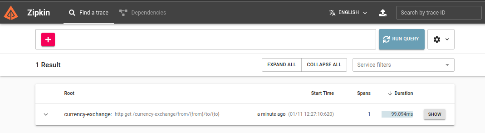
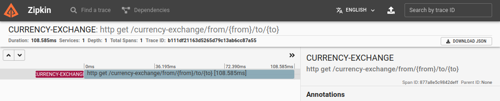

# Spring Boot Zipkin - Docker

Note : We will utilize the microservices created in the last lecture.

## Lets create a ZIP server in Docker
1. Docker command
    ```bash
    docker run -p 9411:9411 openzipkin/zipkin:2.23
    ```
2. Navigate to browser http://localhost:9411/zipkin/

## Obervabality and OpenTelemetry
1. Monitoring is reactive. Observability is proactive
2. Observability is onestep above Monitoring.
3. In Monitoring we get gather metrcsi,logs traces
4. In Observability we gather intelliegenece : Anomaly detection
5. OpenTelemetry - Collection of tools,API etc! 

## Connect Service to Zipkin 

1. Spring Boot 3 - We use micrometer + opentelemetry + zipkin
2. Dependency - `/currency-exchange/build.gradle`

    ```groovy
    //Zipkin
    implementation 'io.micrometer:micrometer-observation:1.12.2'
    implementation 'io.micrometer:micrometer-tracing-bridge-otel:1.2.2'
    implementation 'io.opentelemetry:opentelemetry-exporter-zipkin:1.22.0'
    ```

3. Update Properties `/currency-exchange/src/main/resources/application.yaml`
    ```yaml
    management:
      tracing:
        sampling:
          probability: 1.0
    logging:
      pattern:
        level: '%5p [${spring.application.name:},%X{traceId:-},%X{spanId:-}]' 
    ```
4. Only start the `naming server` ( only to make sure we don't get any error logs for now) & `currency-exchange`

5. Lets do a simple curl on the `currency-exchange` app
    ```bash
    $ curl 'http://localhost:8000/currency-exchange/from/USD/to/INR'
    {"id":1001,"from":"USD","to":"INR","conversionMultiple":65.00,"environment":"8000"}
    ```
6. We navigate to zipkin website and observe the trace shown in the image below
    
    

7. If we do a log statement in our application and capture it.
    ```
    2024-01-11T12:38:06.479+05:30  INFO [currency-exchange,b111df21163d5265d79c13ab6cc87a55,877a8e5c9842deff] 43535 --- [currency-exchange] [nio-8000-exec-1] [b111df21163d5265d79c13ab6cc87a55-877a8e5c9842deff] c.s.c.c.CurrnecyExchangeController       : retrieveExchangeValue called with USD to INR
    ```
8. Notice the 2 numbrs here `b111df21163d5265d79c13ab6cc87a55`,`877a8e5c9842deff`. What happens here is micrometer assign these ID's ! Which helps us navigate. Once we expand a zipkin observation ( show button ) we see the.\
    Trace ID: `b111df21163d5265d79c13ab6cc87a55`\
    Span ID: `877a8e5c9842deff`

    

9. Lets repeat the same to the other 2 services `currency-conversion` & `api-gateway`.
10. For Spring Boot 3 we need an additional dependecy for feign used in `currency-conversion`

    ```groovy
    implementation 'io.github.openfeign:feign-micrometer:12.4'
    ```
11. When using RestTemplate instead of Feign , we need to design the rest-template in a certain way so it integrates with micrometer. `/currency-conversion/src/main/java/com/scripter/currencyconversion/config/CurrencyConversionConfig.java`

    ```java
    @Configuration(proxyBeanMethods = false)
    public class CurrencyConversionConfig {
        @Bean
        RestTemplate restTemplate(RestTemplateBuilder builder) {
            return builder.build();
        }
    }
    ```
12. Use this in the controller
    ```java
    @Autowired
    private RestTemplate restTemplate;
    .
    .
    esponseEntity<CurrencyConversion> responseEntity = restTemplate.getForEntity(....
    ```
13. 