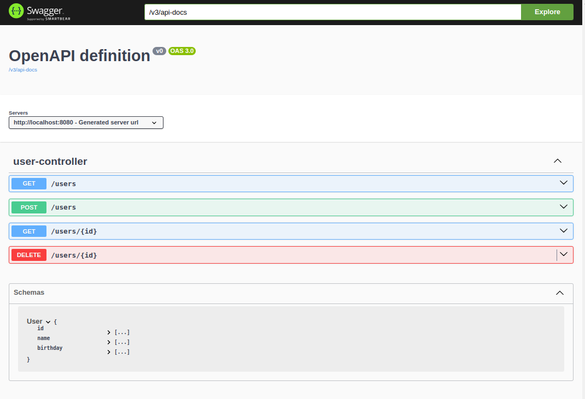

# Documentation

## Swagger

1. Started 2011 , swagger specification was introduced. After sometime swagger specification became OpenAPI spec.

## OpenAPI

1. Started 2016 based on swagger specification
2. https://springdoc.org/

### Maven Version

```groovy
implementation 'org.springdoc:springdoc-openapi-starter-webmvc-ui:2.3.0'
```
3. Start Spring Boot Project and Navigate to http://localhost:8080/swagger-ui/index.html



4. Clicking on the link '/v3/api-docs' will take us to the OpenAPI spec which is a JSON Document.

```json
{
  "openapi": "3.0.1",
  "info": {
    "title": "OpenAPI definition",
    "version": "v0"
  },
  "servers": [
    {
      "url": "http://localhost:8080",
      "description": "Generated server url"
    }
  ],
  "paths": {.
  .

```