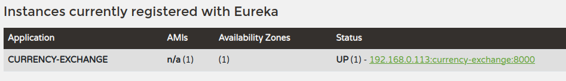
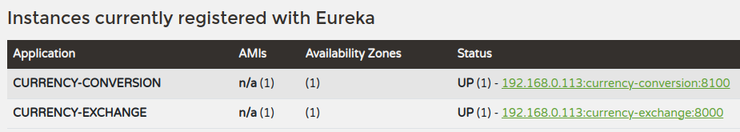

# Spring Cloud Gateway

1. Simple , yet effective way to route to API's
1. Provide cross cutting concerns : security, monitoring/metrics
1. Built on top of Spring WebFlux ( Reactive Approach )
1. Features
   - Match routes on any attribute
   - Define predicates and filters
   - Integrates with Spring Cloud Discovery Client ( Load Balancing )
   - Path Rewriting
1. Lets create some microservices

## `currency-exchange` service `port 8000`

1. Dependency
    ```groovy
    implementation 'org.springframework.boot:spring-boot-starter-actuator'
    implementation 'org.springframework.boot:spring-boot-starter-web'
    implementation 'org.springframework.cloud:spring-cloud-starter-config'
    developmentOnly 'org.springframework.boot:spring-boot-devtools'
    ```
2. Lets add configserver properties in the yaml as we are running spring boot version > 2.4.2
    ```yaml
    server:
      port: 8000
    spring:
      config:
        import: optional:configserver:http://localhost:8888
      application:
        name: currency-exchange
    ```

3. The application should start comfortably now

    ```java
    public class CurrencyExchange {
    	private Long id;
    	private String from;
    	private String to;
    	private BigDecimal conversionMultiple;
        private String environment; // This won't be part of the constructor
        //Getter,Setter,Constructors.
    
    import org.springframework.core.env.Environment;

    @RestController
    public class CurrnecyExchangeController {
    
    	@Autowired
    	private Environment environment;
    
    	@GetMapping("/currency-exchange/from/{from}/to/{to}")
    	public CurrencyExchange retrieveExchangeValue(@PathVariable("from") String from, @PathVariable("to") String to) {
    		CurrencyExchange currencyExchange = new CurrencyExchange(100L, from, to, BigDecimal.valueOf(50));
    		String port = environment.getProperty("local.server.port");
    		currencyExchange.setEnvironment(port);
    		return currencyExchange;
    	}
    
    }
    ```
    Lets Curl it.

    ```bash
    $ curl 'http://localhost:8000/currency-exchange/from/USD/to/INR'
    {"id":100,"from":"USD","to":"INR","conversionMultiple":50,"environment":"8000"}
    ```
4. We can make it run on a different port as well. Using argument properties `--server.port=8001`

    ```bash
    $ java -jar currency-exchange-0.0.1-SNAPSHOT.jar --server.port=8001

      .   ____          _            __ _ _
     /\\ / ___'_ __ _ _(_)_ __  __ _ \ \ \ \
    ( ( )\___ | '_ | '_| | '_ \/ _` | \ \ \ \
     \\/  ___)| |_)| | | | | || (_| |  ) ) ) )
      '  |____| .__|_| |_|_| |_\__, | / / / /
     =========|_|==============|___/=/_/_/_/
     :: Spring Boot ::                (v3.2.1)

    ....
    TomcatWebServer  : Tomcat initialized with port 8001 (http)
    ..

    $ curl 'http://localhost:8001/currency-exchange/from/USD/to/INR'
    {"id":100,"from":"USD","to":"INR","conversionMultiple":50,"environment":"8001"}
    ```
5. We override the port: 8000 in `/currency-exchange/src/main/resources/application.yaml`
6. Anyways, this is a little complicated. `Eclipse` make it easier with `-Dserver.port=8001` in VM arguments present in run configuration.

7. Lets swtich from hardcoded value to H2 DB
8. Add the dependencies to build.gradle ( jpa & h2 )
9. Update `/currency-exchange/src/main/resources/application.yaml`

    ```yaml
    server:
      port: 8000
    spring:
      config:
        import: optional:configserver:http://localhost:8888
      application:
        name: currency-exchange
      h2:
        console:
          enabled: true
      datasource:
        url: jdbc:h2:mem:testdb
      jpa:
        show-sql: true
        defer-datasource-initialization: true
    ```
10. Modify model to entity

    ```java
    import jakarta.persistence.Entity;
    import jakarta.persistence.Id;
    @Entity
    public class CurrencyExchange {
    	@Id
    	private Long id;
    	@Column(name = "currency_from")
    	private String from;
    	@Column(name = "currency_to")
    	private String to;
    	private BigDecimal conversionMultiple;
    	private String environment;

    ```
11. Create `/currency-exchange/src/main/resources/data.sql` with the below data for easy DB load
    ```sql
    insert into CURRENCY_EXCHANGE(ID,CURRENCY_FROM,CURRENCY_TO,CONVERSION_MULTIPLE,ENVIRONMENT) values (1001,'USD','INR',65,'')
    insert into CURRENCY_EXCHANGE(ID,CURRENCY_FROM,CURRENCY_TO,CONVERSION_MULTIPLE,ENVIRONMENT) values (1002,'EUR','INR',75,'')
    insert into CURRENCY_EXCHANGE(ID,CURRENCY_FROM,CURRENCY_TO,CONVERSION_MULTIPLE,ENVIRONMENT) values (1003,'AUD','INR',25,'')
    ```

12. Lets make JPArepo and Controller fetch from DB

    ```java
    public interface CurrencyExchangeRepository extends JpaRepository<CurrencyExchange, Long> {
    	CurrencyExchange findByFromAndTo(String from, String to);
    }
    @RestController
    public class CurrnecyExchangeController {
    
    	@Autowired
    	private CurrencyExchangeRepository exchangeRepository;
    
    	@Autowired
    	private Environment environment;

    	@GetMapping("/currency-exchange/from/{from}/to/{to}")
    	public CurrencyExchange retrieveExchangeValue(@PathVariable("from") String from, @PathVariable("to") String to) {
    		CurrencyExchange currencyExchange = exchangeRepository.findByFromAndTo(from, to);
    		if(currencyExchange == null) {
    			throw new RuntimeException("Unable to find data from " + from + " to" + to);
    		}
    		String port = environment.getProperty("local.server.port");
    		currencyExchange.setEnvironment(port);
    		return currencyExchange;
    	}

    }
    ```
13. Curl it
    ```bash
    $ curl 'http://localhost:8000/currency-exchange/from/USD/to/INR'
    {"id":1001,"from":"USD","to":"INR","conversionMultiple":65.00,"environment":"8000"}
    ```
## `currency-conversion` Microservice `port 8100`

1. application-properties
    ```yaml
    server:
      port: 8100
    spring:
      config:
        import: optional:configserver:http://localhost:8888
      application:
        name: currency-conversion
    ```

2. Simple model 
    ```java
    public class CurrencyConversion {

    	private Long id;
    	private String from;
    	private String to;
    	private BigDecimal quantity;
    	private BigDecimal conversionMultiple;
    	private BigDecimal totalCalculatedAmount;
    	private String environment;
        // Constructors,Getters & Setters
    ```

3. Controller - We do a simple REST API call & fetch data from `currency-exchange`
    ```java
    @RestController
    public class CurrencyConversionController {

    	@GetMapping("/currency-conversion/from/{from}/to/{to}/quantity/{quantity}")
    	public CurrencyConversion calculateCurrencyConversion(
    			@PathVariable("from") String from,
    			@PathVariable("to") String to,
    			@PathVariable("quantity") BigDecimal quantity) {
                
    		HashMap<String, String> uriVariables = new HashMap<>();
    		uriVariables.put("from",from);
    		uriVariables.put("to",to);
    		ResponseEntity<CurrencyConversion> responseEntity = new RestTemplate().getForEntity(
    				"http://localhost:8000/currency-exchange/from/{from}/to/{to}", CurrencyConversion.class, uriVariables);
    		CurrencyConversion curConv = responseEntity.getBody();
    		return new CurrencyConversion(curConv.getId(), from, to, quantity, 
            curConv.getConversionMultiple(), quantity.multiply(curConv.getConversionMultiple()), 
            curConv.getEnvironment());
    	}
    }
    ```

4. Lets Curl It

    ```bash
    $ curl 'http://localhost:8100/currency-conversion/from/USD/to/INR/quantity/10'
    {"id":1001,"from":"USD","to":"INR","quantity":10,"conversionMultiple":65.00,"totalCalculatedAmount":650.00,"environment":"8000"}
    ```
5. Suppose `currency-exchange` app is hoted in multiple places & due to heavy load we need to call the one which has less load in order to make sure our app is running ( load balancing baby ). So it will be quite cumbersome to modify or change the endpoint. So lets do it.

## Feign

1. Dependency in `/currency-conversion/build.gradle`
    ```groovy
    implementation 'org.springframework.cloud:spring-cloud-starter-openfeign'
    ```
2. Add `@EnableFeignClients` in CurrencyConversionApplication
    ```java
    @SpringBootApplication
    @EnableFeignClients
    public class CurrencyConversionApplication {
    ```

3. Create an Interface `/currency-conversion/src/main/java/com/scripter/currencyconversion/proxy/CurrencyExchangeProxy.java`

    ```java
    import org.springframework.cloud.openfeign.FeignClient;
    @FeignClient(name = "currency-exchange", url = "localhost:8000") // Name of the application we want to call.
    public interface CurrencyExchangeProxy {
    	@GetMapping("/currency-exchange/from/{from}/to/{to}")
    	public CurrencyConversion retrieveExchangeValue(@PathVariable("from") String from, @PathVariable("to") String to);
    }
    ```

4.  Controller logic to invoke the feign

    ```java
    @RestController
    public class CurrencyConversionController {
	    @Autowired
	    CurrencyExchangeProxy currencyExchangeProxy;
        @GetMapping("/currency-conversion-feign/from/{from}/to/{to}/quantity/{quantity}")
        public CurrencyConversion calculateCurrencyConversionFeign(
        		@PathVariable("from") String from,
        		@PathVariable("to") String to,
        		@PathVariable("quantity") BigDecimal quantity) {
        	CurrencyConversion curConv = currencyExchangeProxy.retrieveExchangeValue(from,to);
        	return new CurrencyConversion(curConv.getId(), from, to, quantity, curConv.getConversionMultiple(), quantity.multiply(curConv.getConversionMultiple()), curConv.getEnvironment() + " - feign");
        }
    ```
5. Lets Curl it
    ```bash
    $ curl 'http://localhost:8100/currency-conversion-feign/from/USD/to/INR/quantity/10'
    {"id":1001,"from":"USD","to":"INR","quantity":10,"conversionMultiple":65.00,"totalCalculatedAmount":650.00,"environment":"8000 - feign"}
    ```
6. So feign helps us with the HTTP call but we still are using a hardcoded value above `  @FeignClient(name = "currency-exchange", url = "localhost:8000")`. This is not dynamic.

## Naming Server / Service Registry - Eureka - `naming-server` microserver `port 8761`

In microservice architecture all the instances of all the microservice would register with a service registry. So for service to service communication , the naming service or service registry will provide the endpoint. It also load balances

1. Dependency
    ```groovy
    implementation 'org.springframework.cloud:spring-cloud-starter-netflix-eureka-server'
    ```
2. In NamingServerApplication add `@EnableEurekaServer`

    ```java
    @EnableEurekaServer
    @SpringBootApplication
    public class NamingServerApplication {
    ```
3. Application properties 

    ```groovy
    server:
      port: 8761
    spring:
      application:
        name: naming-server
    eureka:
      client:
        register-with-eureka: false
        fetch-registry: false
    ```
4. Start the app & open the browser `http://localhost:8761`
5. We observe the eureka app. Also we see nothing is registered with eureka
6. Lets now register the above 2 services - `currency-conversion` & `currency-exchange` with naming server 

## Register microservers to `naming-server`

1. Add dependency to  `/currency-conversion/build.gradle` &  `/currency-conversion/build.gradle`
    ```groovy
    implementation 'org.springframework.cloud:spring-cloud-starter-netflix-eureka-client'
    ```
2. Lets start `currency-exchange` and  `naming-server`. Once we navigate to `http://localhost:8761`. We observe that the application has been registered

    

3. But lets do some additional stuff to be really safe. So lets configure naming server url is application properties. In file `/currency-exchange/src/main/resources/application.yaml` & `/currency-conversion/src/main/resources/application.yaml`

    ```yaml
    eureka:
      client:
        serviceUrl:
          defaultZone: http://localhost:8761/eureka
    ```

4. Once we navigate to `http://localhost:8761`. We see both

    

## Load Balancing - Client Side

1. Navigate to `/currency-conversion/src/main/java/com/scripter/currencyconversion/proxy/CurrencyExchangeProxy.java` & remove <s>`url = "localhost:8000"`</s> from `@FeignClient(name = "currency-exchange", url = "localhost:8000")`

    ```java
    @FeignClient(name = "currency-exchange")
    public interface CurrencyExchangeProxy {
    ```

2. This will make feign pull data from the naming server

    ```bash
    {"id":1001,"from":"USD","to":"INR","quantity":10,"conversionMultiple":65.00,"totalCalculatedAmount":650.00,"environment":"8000 - feign"}
    ```
3. So app is working , however lets do one more thing. Launch  `/currency-exchange` on a new port as well. We can use the terminal

    ```bash
    $ java -jar currency-exchange-0.0.1-SNAPSHOT.jar --server.port=8000
    $ java -jar currency-exchange-0.0.1-SNAPSHOT.jar --server.port=8001
    ```

4. We can see the apps registered in eureka as well. 2 Instances of `currency-exchange`

    ```text
    CURRENCY-EXCHANGE	n/a (2)	(2)	UP (2) - 192.168.0.113:currency-exchange:8001 , 192.168.0.113:currency-exchange:8000
    ```

5. Lets Curl multiple times

    ```bash
    {"id":1001,"from":"USD","to":"INR","quantity":10,"conversionMultiple":65.00,"totalCalculatedAmount":650.00,"environment":"8000 - feign"}
    $ curl 'http://localhost:8100/currency-conversion-feign/from/USD/to/INR/quantity/10'
    {"id":1001,"from":"USD","to":"INR","quantity":10,"conversionMultiple":65.00,"totalCalculatedAmount":650.00,"environment":"8001 - feign"}
    $ curl 'http://localhost:8100/currency-conversion-feign/from/USD/to/INR/quantity/10'
    {"id":1001,"from":"USD","to":"INR","quantity":10,"conversionMultiple":65.00,"totalCalculatedAmount":650.00,"environment":"8000 - feign"}
    ```

6. See the change in environment evident by the PORT number captured. So we see load balancing happening :smiley:
7. The loadbalancer is done here through eureka and feign. There is also a separate load-balancer starter

## Spring Gateway - `api-gateway` microservice `port 8765` 

1. Dependency 
    ```groovy
    implementation 'org.springframework.cloud:spring-cloud-starter-gateway'
    ```
2. `/api-gateway/src/main/resources/application.yaml` file 
    ```yaml
    server:
      port: 8765
    spring:
      application:
        name: api-gateway
    eureka:
      client:
        serviceUrl:
          defaultZone: http://localhost:8761/eureka
    ```
3. Once we start the `api-gateway` , we see its reflecting the eureka instance
    ```
    Application	AMIs	Availability Zones	Status
    API-GATEWAY	n/a (1)	(1)	UP (1) - 192.168.0.113:api-gateway:8765
    ```

4. So what we can do is something like 
    `http://localhost:8765/CURRENCY-EXCHANGE/currency-exchange/from/USD/to/INR`. If we break it down.\
    Its `CURRENCY-EXCHANGE` captured from eureka Instances dashboard and `currency-exchange/from/USD/to/INR`\ 
    is from actual call to `currency-exchange` service\
    captured from `$ curl 'http://localhost:8000/currency-exchange/from/USD/to/INR'`

5. To do the above we need go to `/api-gateway/src/main/resources/application.yaml` and add the following.
    ```yaml
    spring:
      cloud:
        gateway:
          discovery:
            locator:
              enabled: true
    ```
This is working because of feign and eureka enabled & registered.

6. Curl it
    ```bash
    $ curl 'http://localhost:8765/CURRENCY-EXCHANGE/currency-exchange/from/USD/to/INR'
    {"id":1001,"from":"USD","to":"INR","conversionMultiple":65.00,"environment":"8001"}

    $ curl 'http://localhost:8765/CURRENCY-CONVERSION/currency-conversion-feign/from/USD/to/INR/quantity/10'
    {"id":1001,"from":"USD","to":"INR","quantity":10,"conversionMultiple":65.00,"totalCalculatedAmount":650.00,"environment":"8000 - feign"}

    $ curl 'http://localhost:8765/CURRENCY-CONVERSION/currency-conversion/from/USD/to/INR/quantity/10'
    {"id":1001,"from":"USD","to":"INR","quantity":10,"conversionMultiple":65.00,"totalCalculatedAmount":650.00,"environment":"8000"}
    ```
7. So we also did it for `currency-conversion`.
8. This makes it easier for us to invoke services, like enabling security and all.
9. Howeveer the capital `CURRENCY-CONVERSION` keywords doesn't look good.
10. Lets change it.
    ```yaml
    #Complete YAML
    server:
      port: 8765
    spring:
      application:
        name: api-gateway
      cloud:
        gateway:
          discovery:
            locator:
              enabled: true
              lower-case-service-id: true ### This field helps us with lower case.
    eureka:
      client:
        serviceUrl:
          defaultZone: http://localhost:8761/eureka
    ```
11. Curl it

    ```bash
    $ curl 'http://localhost:8765/currency-conversion/currency-conversion/from/USD/to/INR/quantity/10'
    {"id":1001,"from":"USD","to":"INR","quantity":10,"conversionMultiple":65.00,"totalCalculatedAmount":650.00,"environment":"8000"}
    ```

12. Lets take this one more step further and build custom routes using custom filters. First we disable above `locator.enabled` & `locator.lower-case-service-id` properties by commenting or deleting it. Then we create a complex  config class

    `/api-gateway/src/main/java/com/scripter/apigateway/config/ApiGatewayConfig.java`

    ```java
    @Configuration
    public class ApiGatewayConfig {
    	@Bean
    	public RouteLocator gatewayRouter(RouteLocatorBuilder builder) {
    		return builder.routes()
    				.route(rtf -> rtf.path("/get")
    						.filters(gfs -> gfs
    								.addRequestHeader("MyHeader", "MyURI")
    								.addRequestParameter("Param", "MyValue"))
    						.uri("http://httpbin.org:80"))
    				.route(rtf -> rtf.path("/currency-exchange/**")
    						.uri("lb://currency-exchange"))
    				.route(rtf -> rtf.path("/currency-conversion/**")
    						.uri("lb://currency-conversion"))
    				.route(rtf -> rtf.path("/currency-conversion-feign/**")
    						.uri("lb://currency-conversion"))
    				.route(rtf -> rtf.path("/currency-conversion-new/**")
    						.filters(gfs -> gfs.rewritePath("/currency-conversion-new/(?<segement>.*)", "/currency-conversion-feign/${segement}"))
    						.uri("lb://currency-conversion"))
    				.build();
    	}
    }
    ```

13. `http://httpbin.org:80` is test website. We added request header and parameter to the outgoing http request to `/get`. So once we invoke `http://localhost:8765/get` we get a json structure back with the above data. Even though we invoked /get we go rerouter to `http://httpbin.org:80` with additional details. This can be extend to security functionalities.

    ```json
    {
    "args": {
        "Param": "MyValue"
    }, 
    "headers": {
    ....
        "Myheader": "MyURI", 
    ```
14. Next example are straightforward. We enter `/currency-exchange/**` in the endpoint and  get rerouted to application. `lb` makes sure loadbalancer is applicable\
Sample curls

    ```bash
    $ curl 'http://localhost:8765/currency-exchange/from/USD/to/INR'
    {"id":1001,"from":"USD","to":"INR","conversionMultiple":65.00,"environment":"8001"}

    $ curl 'http://localhost:8765/currency-conversion/from/USD/to/INR/quantity/10'
    {"id":1001,"from":"USD","to":"INR","quantity":10,"conversionMultiple":65.00,"totalCalculatedAmount":650.00,"environment":"8000"}

    $ curl 'http://localhost:8765/currency-conversion-feign/from/USD/to/INR/quantity/10'
    {"id":1001,"from":"USD","to":"INR","quantity":10,"conversionMultiple":65.00,"totalCalculatedAmount":650.00,"environment":"8000 - feign"}

    $ curl 'http://localhost:8765/currency-conversion-new/from/USD/to/INR/quantity/10'
    {"id":1001,"from":"USD","to":"INR","quantity":10,"conversionMultiple":65.00,"totalCalculatedAmount":650.00, "environment":"8000 - feign"}
    ```

15. `/currency-conversion-new/**` this facinating as we don't have this endpoint in our app. We randomly created it. However thanks to API gateway we routed it to `currency-conversion-feign` endpoint.

16. Lets Build a logging filter to monitor logs.
17. Create a new class `/api-gateway/src/main/java/com/scripter/apigateway/config/LoggingFilter.java`

    ```java
    import org.slf4j.Logger;
    import org.slf4j.LoggerFactory;
    import org.springframework.cloud.gateway.filter.GatewayFilterChain;
    import org.springframework.cloud.gateway.filter.GlobalFilter;
    import org.springframework.stereotype.Component;
    import org.springframework.web.server.ServerWebExchange;

    import reactor.core.publisher.Mono;

    @Component
    public class LoggingFilter implements GlobalFilter{
      private Logger logger = LoggerFactory.getLogger(LoggingFilter.class);
      @Override
      public Mono<Void> filter(ServerWebExchange exchange, GatewayFilterChain chain) {
        logger.info("Path of Request -> {}",exchange.getRequest().getPath());
        return chain.filter(exchange);
      }
    }
    ```

18. Once we curl some requests through the API Gateway , we see the logs in console

    ```
    LoggingFilter :Path of Request -> /currency-exchange/from/USD/to/INR
    LoggingFilter :Path of Request -> /currency-conversion/from/USD/to/INR/quantity/10
    ```
## Circuit Breaker

1. What happens when one of the service in the microservice chain fails & it impacts the whole flow
1. Can we return a fallback response if a service is down?
1. Can we implement a 'circuit-breaker' pattern to reduce load ?
1. Can we retry requests in case of temporary failures
1. Can we implement rate-limiting ( allow certain number of calls to specific microservice in a specific period of time ) ? 

`Resilience4j` enters the chat - https://resilience4j.readme.io/docs/getting-started-3

1. We can shut the above spring apps and just navigate to `/currency-exchange/build.gradle` and add the dependency 
    ```groovy
    implementation 'io.github.resilience4j:resilience4j-spring-boot3'
    implementation 'io.github.resilience4j:resilience4j-reactor'
    implementation 'org.springframework.boot:spring-boot-starter-aop'
    implementation 'org.springframework.boot:spring-boot-starter-actuator'
    ```
2. Lets retry an API call if its fails. New Controller `/currency-exchange/src/main/java/com/scripter/currencyexchange/controller/CircuitBreakerController.java`

```java
import io.github.resilience4j.retry.annotation.Retry;
@RestController
public class CircuitBreakerController {
	private static final Logger log = LoggerFactory.getLogger(CircuitBreakerController.class);
	@Retry(name = "default")
	@GetMapping("/sample-api")
	public String sampleAPI() {
		log.info("Sample API Invoked");
		ResponseEntity<String> forEntity = new RestTemplate().getForEntity("http://localhost:8080/some-dummy-rul", String.class); // Bogus Endpoint
		return forEntity.getBody();
	}
}
```

3. Once we invoke the above API calls. In the logs we observe its been retried 3 times before failure.
  ```
  Sample API Invoked
  Sample API Invoked
  Sample API Invoked
  ```
4. 3 times retry is by default. Lets modify it. First by renaminig `@Retry(name = "default")` to `@Retry(name = "sample-api")`  then in `/currency-exchange/src/main/resources/application.yaml`

```yaml
resilience4j:
  retry:
    instances:
      sample-api:
        max-attempts: 5
```
5. We can also have a fallback response 
    ```java
    @Retry(name = "sample-api",fallbackMethod = "hardcodedResponse")
    @GetMapping("/sample-api")
    public String sampleAPI() {
    ...
    }
    public String hardcodedResponse(Exception ex) {
      return "fallback-reponse";
    }
    ```
6. Once we curl it
    ```bash
    $ curl 'http://localhost:8000/sample-api'
    fallback-reponse
    ```

7.Some other properties
  - wait-duration - How much we wait before kicking off another call.
  - Exponential Backoff - Attemps to call API increases exponentially

    ```yaml
    resilience4j:
      retry:
        instances:
          sample-api:
            max-attempts: 5
            wait-duration: 1s
            enable-exponential-backoff: true
    ```
8. Lets replace retry with circuit breaker and do some performance tests. The above properties of retry have NO coleration with circuit breaker. URL : https://resilience4j.readme.io/docs/circuitbreaker

```java
@CircuitBreaker(name = "sample-api",fallbackMethod = "hardcodedResponse")
	@GetMapping("/sample-api")
	public String sampleAPI() {
		log.info("Sample API Invoked");
```

9. bash commands for performance 
```bash
watch curl -i 'http://localhost:8000/sample-api'   # Does a Curl Every 2.0s: curl -i http://localhost:8000/sample-api
$ watch -n 0.1 curl -i 'http://localhost:8000/sample-api' # Every 0.1s: curl -i http://localhost:8000/sample-api 
```

10. Circuit difficult is difficult to take notes on. Best approach would be to code + Watch video
11. Rate Limit ( Lets do 2 request every 10 seconds ) & Bulkhead ( concurrent calls )

    ```java
    @Bulkhead(name = "sample-api")
    @RateLimiter(name = "default")
    @GetMapping("/sample-api")
    public String sampleAPI() throws InterruptedException {
      log.info("Sample API Invoked");
      return "sample-api";
    }
    ```
    ```yaml
    resilience4j:
      ratelimiter:
        instances:
          default:
            limit-for-period: 2
            limit-refresh-period: 10s
      bulkhead:
        instances:
          default:
            max-concurrent-calls: 10
    ```