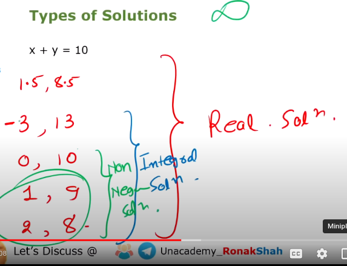

# Algebra

1. Source : https://www.youtube.com/playlist?list=PLh-uxFrOdsq-T-M7YqC4zJY4gRfnBKWdw

1. Algebrics Expression
    - $4x^2$
    - $2xyz - 7y^2$
    - $3x^3 + 4y^2 + 110$
1. Once we equate the above to = 0 or something. It becomes an equation
    - $4x^2 = 0$
    - $2xyz - 7y^2 = 5x$
    - $3x^3 + 4y^2 + 110 = ? $
1. If we use a a > or < than sign instead of equals. It becomes inequality
    - $4x^2 > 0$
    - $2xyz - 7y^2 > 5x$
    - $3x^3 + 4y^2 + 110 > ? $

## Terms in Algebric Expression

1. What ever is sperated by $+$ or $-$ that becomes a term.
1. $5x^2$ -> 1 term -> Monomial Expression
1. $2xyz - 7y^2$ -> 2 terms -> Biomonial Expresssion
1. $3x^3 + 4y^2+110$ -> 2 or more terms -> Polynomial Expression

## Degree/Order in Algebric Expression

1. Total Commulative power of all the variables in the term decides its degree
1. $5x^2$ -> Degree is 2
1. $2xyz - 7y^2$ -> 3
    - The first term has xyz so 3 degrees
1. $3x^4 + 4x^3y^2 + xyz$ -> 5
    - the second term has degree 5
1. Degree helps us indentify the number of solutions

## Solutions

1. Types
    - Real Solutions
    - Integral(Intger Value) Solutions
    - Non Negative Solution
    - +ve Integral/Natural no# Solution

## The difference

1. $P(x) = x^2 - 6x + 8$ is  Polynomial
    - Graph is always drawn for Quadratic Polynomial

1. $x^2 - 6x + 8$ is a Quadratic Expression
    - There is 'y' here so we can't draw a graph

1. $x^2 - 6x + 8 = 0$ is a Quadratic Equation
    - We cannot plot graph of Quadratic Equation as 'y' isn't present.  